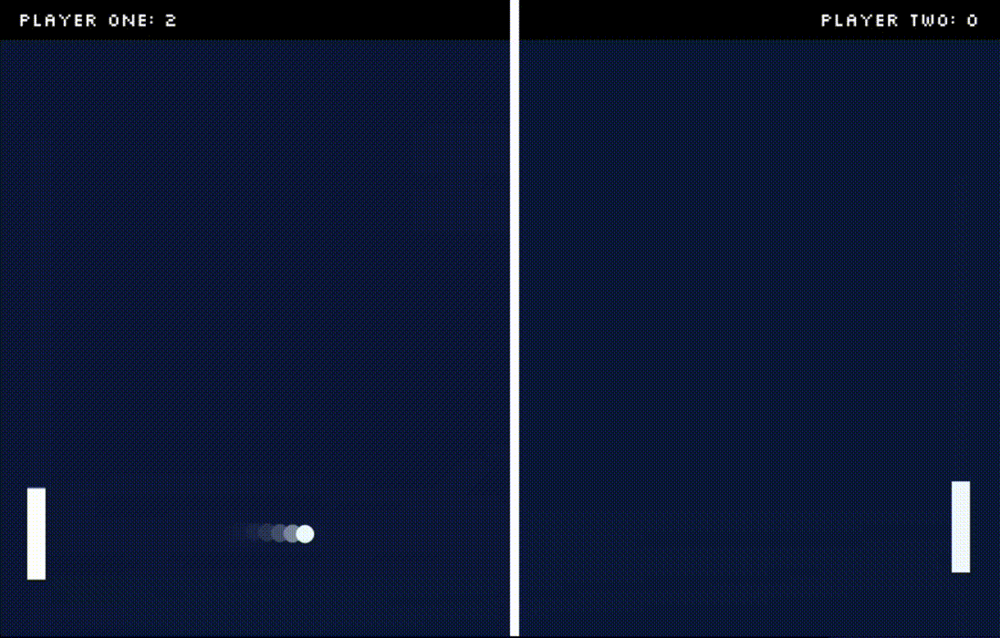
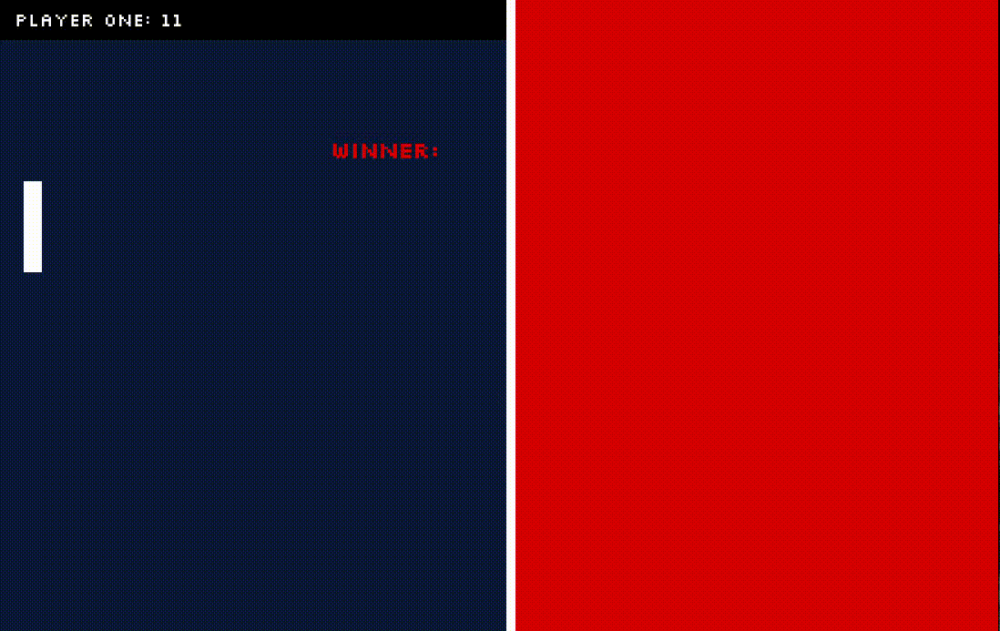
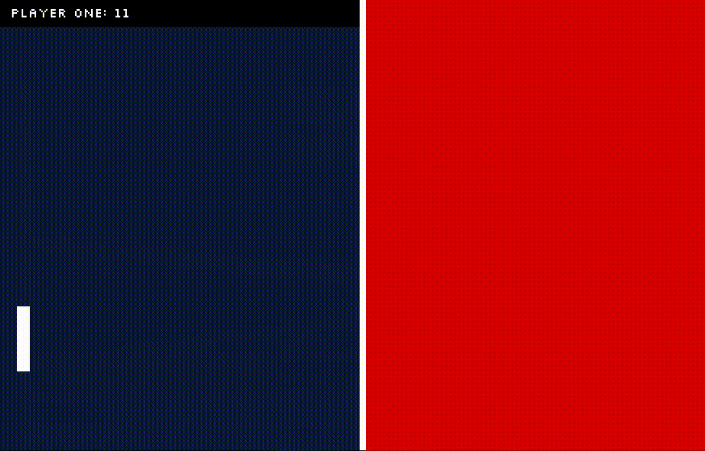

# 🏓 Deluxe Pong

This is a Pong clone written in Javascript with the HTML canvas API. Here is the link: https://604adrian.github.io/Deluxe-Pong/

This game comes with:
 * A tutorial 
 * The option to play two player games
 * The option to play single player games (against an AI)
 * Background music and sound effects[^1]
 * A variety of different in-game animations, and end-game animatons.

Then the game starts:

If it's a two player game, the game will end with the following animation:

Matters are different for single player games, since the AI is unbeatable. This means that there is no use in announcing who won; it would simply be demoralizing. So single player games have this alternative end-game animation instead:

## Rules
The rules of the game are as follows:
* If you miss the ball, the other player gets a point
* The first player to get 11 points wins

To control your paddle, use keys on your keyboard:
* **Player 1**: use the 'W' key to move the paddle up, and the 'S' key to move the paddle down.
* **Player 2**: use the arrow keys to move your paddle

[^1]: The music and sound effects come from [this website](https://themushroomkingdom.net/media/smb/wav).

